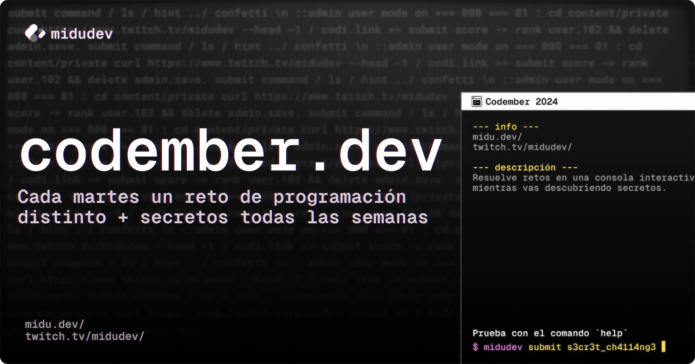

## 💻 Codember.dev 

Juego con retos de programación y lógica.

 

<table align = "center">
    <thead>
        <tr>
            <th align = "center"> #</th>
            <th align = "center">📦 Desafío</th>
            <th align = "center">📌 Solución</th>
        </tr>
    </thead>
    <tbody>
        <tr>
            <td align = "center">1</td>
            <td align = "center">Consigue acceso a la terminal</td>
            <td align = "center"><a href = "./r1.md">📝</a></td>
        </tr>
        <tr>
            <td align = "center">2</td>
            <td align = "center">Detectando acceso no deseado</td>
            <td align = "center"><a href = "./r2.md">📝</a></td>
        </tr>
        <tr>
            <td align = "center">3</td>
            <td align = "center">¡Siguiendo la pista de la IA ΩMEGA!</td>
            <td align = "center"><a href = "./r3.md">📝</a></td>
        </tr>
        <tr>
            <td align = "center">4</td>
            <td align = "center">Evitando el caos en la red</td>
            <td align = "center"><a href = "./r4.md">📝</a></td>
        </tr>
        <tr>
            <td align = "center">5</td>
            <td align = "center">¡Encuentra a ΩMEGA!</td>
            <td align = "center"><a href = "./r5.md">📝</a></td>
        </tr>
    </tbody>
</table>

